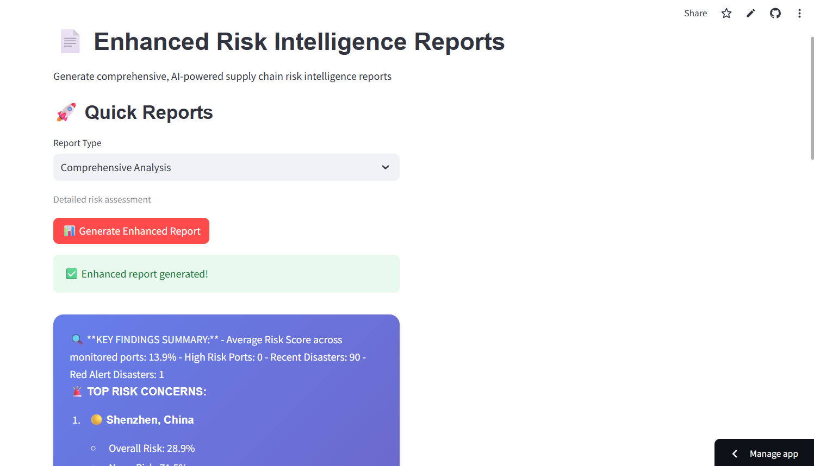

# 🚢 AI Supply Chain Intelligence Platform

An **end-to-end intelligent supply chain monitoring platform** built with **Azure Databricks, Azure OpenAI, and Streamlit**, providing real-time insights into logistics disruptions, route risks, and global trade vulnerabilities.


## 🌐 Overview

This platform combines **data engineering**, **AI-driven analytics**, and **interactive visualization** to assess and display supply chain risks.  
It continuously ingests event data (e.g., disasters, news, logistics updates), analyzes disruptions, and visualizes insights through an interactive Streamlit dashboard.

## ✨ Key Capabilities

- 🤖 **AI-Powered Risk Analysis** — Uses Azure OpenAI to assess and summarize global risk signals  
- 🗺️ **Interactive Route Insights** — Real-time mapping and route-level risk analysis  
- 📊 **Dynamic Dashboards** — Streamlit-based visualization for ports, routes, and disasters  
- 🌪️ **Event Monitoring** — Integration with live APIs for disaster and news tracking  
- 📄 **Automated Reporting** — Generates AI reports and route intelligence summaries  

## 🧠 Architecture Overview

```
[Databricks Notebooks] --> [Delta Tables / Processed Features]
           ↓
     [Azure OpenAI APIs]
           ↓
  [Streamlit Frontend Dashboard]
```

* **Databricks** — Handles data ingestion, processing, and ML feature creation
* **Azure OpenAI** — Provides LLM-based event summarization and report generation
* **Streamlit App** — Interactive user interface for visualization and exploration

## 🧱 Tech Stack

### Core Technologies

| Category                   | Tools Used                                                   |
| -------------------------- | ------------------------------------------------------------ |
| **Data Engineering**       | Azure Databricks, PySpark                                    |
| **AI & Analytics**         | Azure OpenAI API                                             |
| **Visualization**          | Streamlit, Plotly Express, Plotly Graph Objects              |
| **APIs / Data Sources**    | Custom REST APIs, GDACS (disaster data), GNews (news events) |
| **Environment Management** | Python 3.8+, pip, virtualenv                                 |

## 📘 Databricks Notebooks

| Notebook                                            | Description                                                                        |
| --------------------------------------------------- | ---------------------------------------------------------------------------------- |
| 🧩 **01 – Azure Databricks Environment Setup**      | Configures clusters, mounts, secrets, and connections to Azure and external APIs   |
| 🔄 **02 – Data Ingestion & Processing Pipeline**    | Collects and transforms data from APIs (GDACS, GNews) and structured datasets      |
| ⚙️ **03 – Feature Engineering & Risk Analysis**     | Extracts risk features, computes indicators, and applies AI-based risk scoring     |
| ☁️ **04 – AI Agent Integration & Cloud Deployment** | Integrates Azure OpenAI and deploys models, enabling API and Streamlit connections |

All notebooks are located in the `databricks/` directory and can be imported into your Azure Databricks workspace.

## 🎨 Streamlit Application

The Streamlit interface (`streamlit/enhanced_streamlit_app.py`) provides:

* An **AI Assistant** for conversational risk queries
* A **Risk Dashboard** with real-time port risk maps and metrics
* **Route Analysis** with AI-generated summaries and comparisons
* **Report Generation** for comprehensive daily or custom insights

### App Preview

| Section             | Screenshot                                   |
| ------------------- | -------------------------------------------- |
| 🏠 Main Dashboard   |  |
| 📊 Risk Dashboard   |  |
| 🗺️ Route Analysis  |  |
| 📄 Report Generator |                |

## 🧩 Project Workflow

1. **Environment Setup** — Configure Databricks cluster, secrets, and mounts
2. **Data Ingestion** — Collect & clean disaster/news/supply chain data
3. **Feature Engineering** — Compute route-level and regional risk metrics
4. **AI Risk Analysis** — Generate insights using Azure OpenAI models
5. **Visualization** — Display results via the Streamlit web interface
6. **Automation** — Generate on-demand and daily AI reports

## 📁 Repository Structure

```
supply-chain-ai-platform/
├── databricks/
│   ├── 01_Environment_Setup.ipynb
│   ├── 02_Data_Ingestion_Pipeline.ipynb
│   ├── 03_FeatureEnginnering_RiskAnalysis.ipynb
│   └── 04_AIAgent_CloudDeployment.ipynb
├── streamlit/
│   └── enhanced_streamlit_app.py
├── assets/
│   ├── main_dashboard.png
│   ├── risk_dashboard.png
│   ├── route_analysis.png
│   └── reports.png
├── requirements.txt
└── README.md
```

## ⚙️ Installation & Local Development

### Prerequisites

* Python **3.8+**
* Access to **Azure Databricks**
* Access to **Azure OpenAI API**
* API keys for GDACS and GNews (optional if using sample data)

### Local Setup

```bash
# Clone repository
git clone https://github.com/<your-username>/supply-chain-ai-platform.git
cd supply-chain-ai-platform

# Install dependencies
pip install -r requirements.txt

# Add environment variables
cp .env.example .env
# Edit .env with your keys and endpoints

# Launch Streamlit app
streamlit run streamlit/enhanced_streamlit_app.py
```

## 🔧 Configuration

Create a `.env` file with the following variables:

```
AZURE_OPENAI_API_KEY=your_azure_openai_key
AZURE_OPENAI_ENDPOINT=your_azure_openai_endpoint
GDACS_API_KEY=your_gdacs_api_key
GNEWS_API_KEY=your_gnews_api_key
DATABRICKS_HOST=your_databricks_host
DATABRICKS_TOKEN=your_databricks_token
```

## 🚀 Databricks Deployment

1. Import all notebooks in the `databricks/` folder into your Azure Databricks workspace
2. Configure your cluster with the required libraries (PySpark, requests, etc.)
3. Mount external storage and set secrets for API keys
4. Execute notebooks sequentially:

   * `01_Environment_Setup.ipynb`
   * `02_Data_Ingestion_Pipeline.ipynb`
   * `03_FeatureEnginnering_RiskAnalysis.ipynb`
   * `04_AIAgent_CloudDeployment.ipynb`

## 📈 Performance Overview

| Metric                    | Description                                      |
| ------------------------- | ------------------------------------------------ |
| ⏱️ **Processing Latency** | < 5 minutes for real-time event updates          |
| 🌍 **Data Coverage**      | 150+ countries and multiple event categories     |
| ⚙️ **Scalability**        | Handles millions of daily records via Databricks |
| 🤖 **AI Integration**     | Dynamic risk summaries via Azure OpenAI          |


## 📄 License

This project is licensed under the **MIT License**. See the [LICENSE](LICENSE) file for details.


```

You can copy this entire content and paste it into a `README.md` file in your repository. All formatting, tables, code blocks, and structure will be preserved.
